# GloboRetail Hybrid ETL & ELT Data Pipeline

A hybrid data-engineering pipeline for **GloboRetail**. Apache Airflow orchestrates the ETL workflow, while Snowflake provides the warehouse, star schema, and analytical presentation layer.

## Project Overview

The pipeline processes retail sales and product data from Amazon S3. Python and Pandera validate and transform the source data, preserve rejected records for traceability, and write validated data to the processed S3 zone as Parquet. Snowflake then loads the processed data into a cleansed layer, builds a dimensional model, and exposes materialized views for analysis.

## Architecture

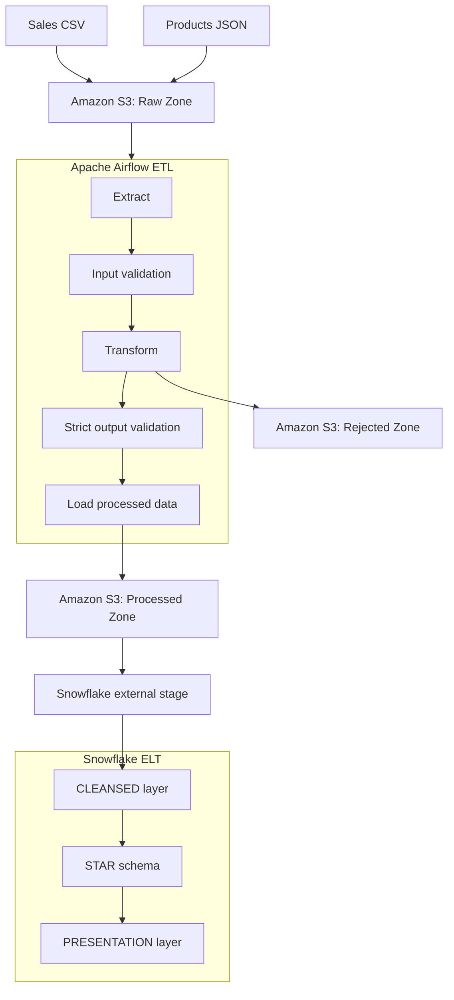

## Technology Stack

| Technology | Purpose |
| --- | --- |
| Python, Pandas, Pandera | ETL transformations and data validation |
| Apache Airflow / Astronomer Astro | Workflow orchestration and local development |
| Amazon S3 | Raw, processed, and rejected data zones |
| PyArrow / Parquet | Typed, columnar processed-data format |
| Snowflake / SQL | ELT, dimensional modelling, and analytics |
| Docker | Airflow runtime environment |

## Data Sources

Two datasets are stored in the S3 raw zone:

- **Sales CSV:** sales and product identifiers, region, quantity, price, timestamp, discount, and order status.
- **Products JSON:** product identifier, category, brand, rating, stock status, and launch date.

The source data intentionally includes quality inconsistencies such as mixed casing, missing values, and malformed values.

## Pipeline Flow

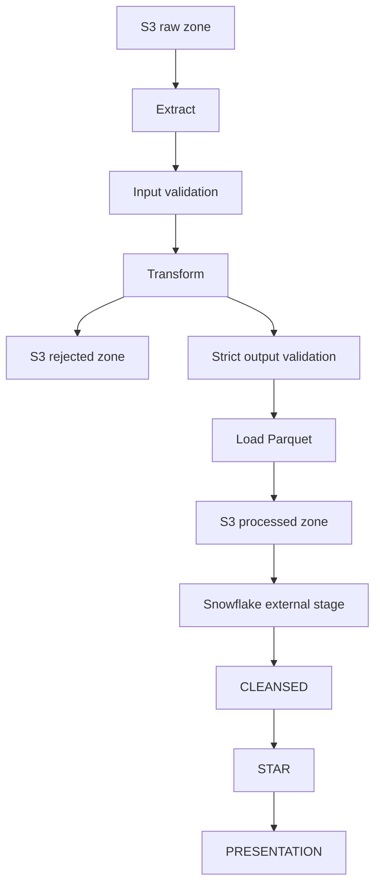

### Airflow orchestration

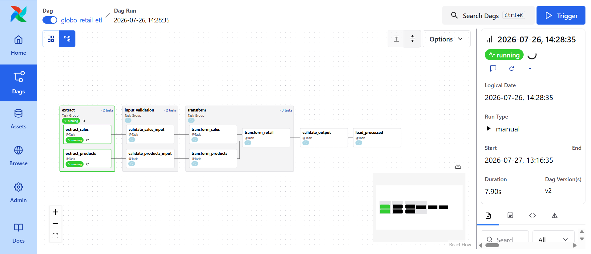

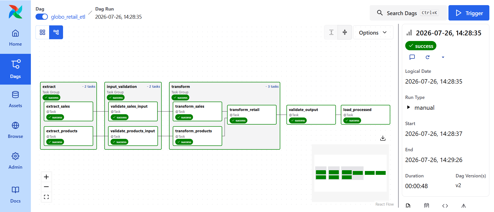

## Data Quality

### Input validation

Input validation is lightweight and non-blocking. It checks expected columns, source-compatible data types, and structural consistency. Failures are logged so the transformation layer can determine whether values can be safely represented.

### Transformation-level rejection

Records are rejected only when a value cannot be safely converted to the analytical representation—for example, a price of `"twenty"`. Rejected sales and product records are retained in S3 for traceability rather than silently discarded.

### Strict output validation

The transformed retail dataset must satisfy a strict Pandera schema before it can enter the processed zone. Checks include final columns and types, nullability, unique sales identifiers, valid regions and statuses, positive quantities, non-negative prices, valid discounts, product completeness, rating ranges, and revenue consistency.

```text
gross_revenue   = quantity × price
discount_amount = gross_revenue × discount
net_revenue     = gross_revenue − discount_amount
```

Output validation is a hard quality gate: if it fails, `load_processed` is not executed.

### S3 zones and outputs

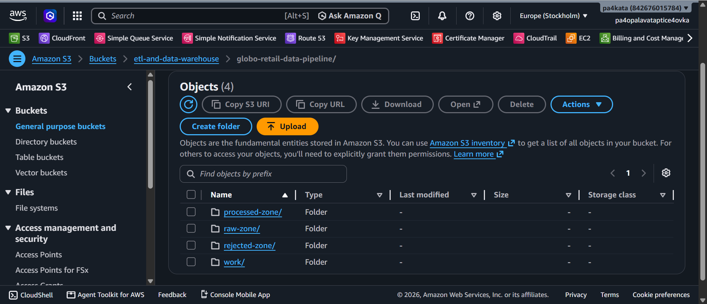

| Raw input data | Processed output | Rejected output |
| --- | --- | --- |
| 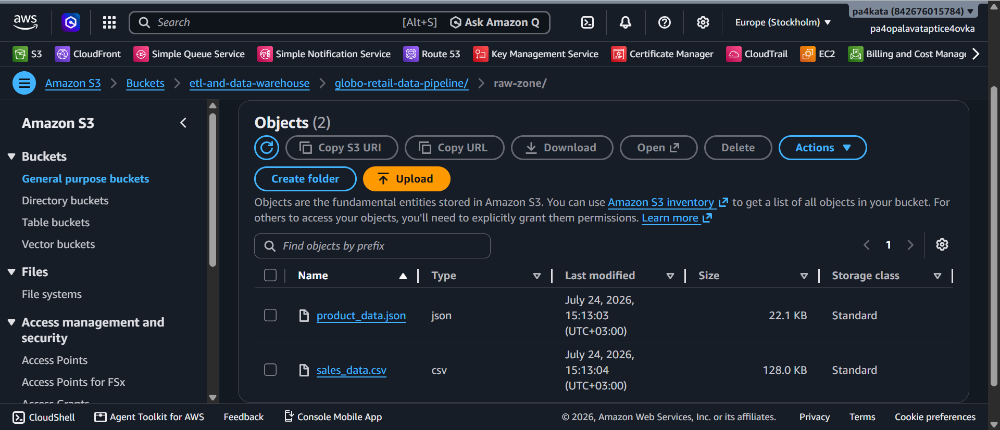 |  | 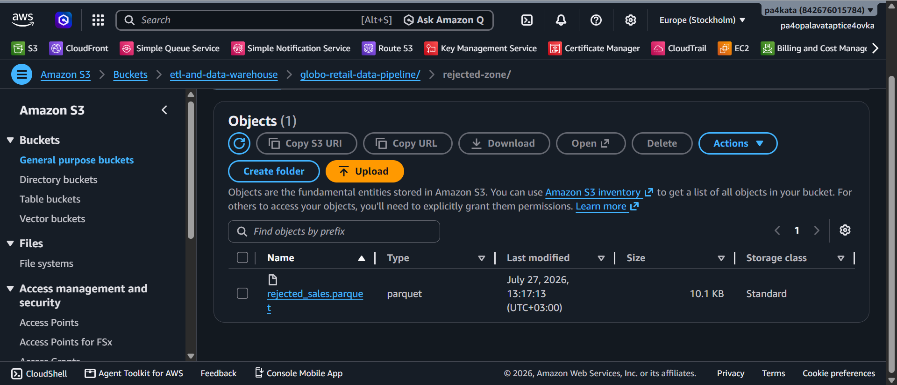 |

The final validated dataset is written as `processed-zone/sales_clean.parquet`. Rejected data is written as separate sales and products Parquet outputs in the rejected zone.

## Snowflake Model

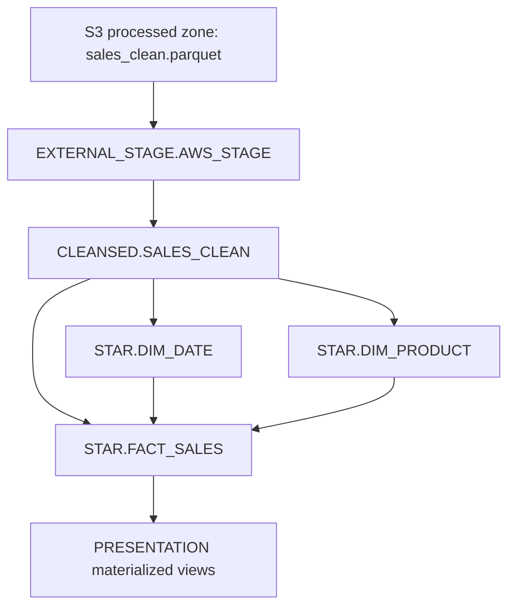

### Database structure

```text
GLOBO_RETAIL_DB
├── EXTERNAL_STAGE
│   ├── AWS_STAGE
│   └── PARQUET_FILE_FORMAT
├── CLEANSED
│   └── SALES_CLEAN
├── STAR
│   ├── DIM_DATE
│   ├── DIM_PRODUCT
│   └── FACT_SALES
└── PRESENTATION
    ├── MV_SALES_BY_REGION_MONTH
    ├── MV_TOP_PRODUCTS_BY_REVENUE
    ├── MV_REVENUE_TREND
    └── MV_CATEGORY_PERFORMANCE
```

### Star schema

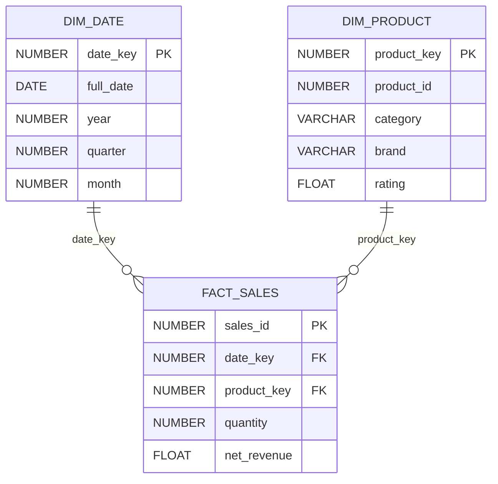

`DIM_DATE` provides reusable calendar attributes, `DIM_PRODUCT` stores descriptive product metadata, and `FACT_SALES` contains retail transactions and their analytical measures.

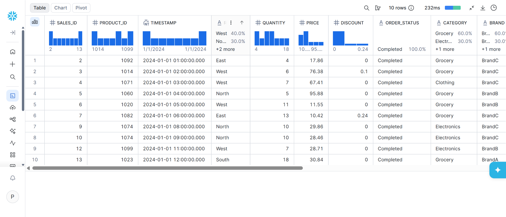

| Date dimension | Product dimension | Sales fact |
| --- | --- | --- |
| 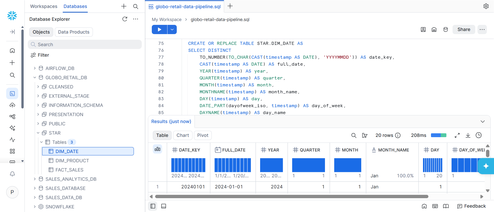 | 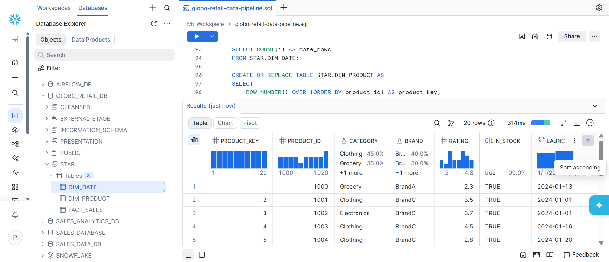 | 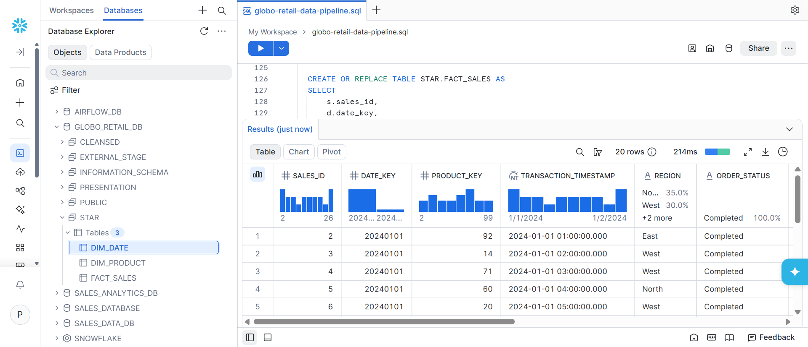 |

### Presentation layer

The `PRESENTATION` schema exposes materialized views for monthly regional sales, top products by revenue, revenue trends, and category performance.

| Sales by region and month | Top products by revenue |
| --- | --- |
| 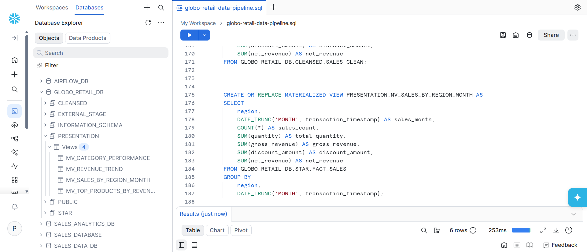 | 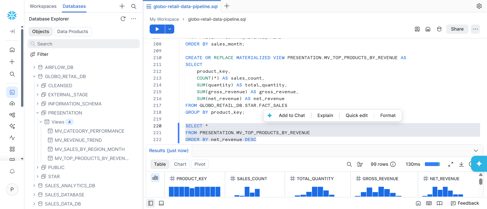 |

| Revenue trend | Category performance |
| --- | --- |
| 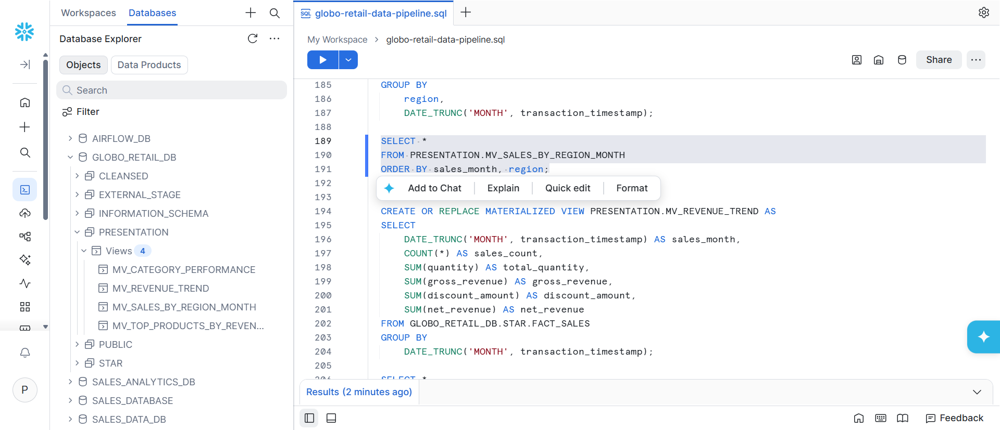 | 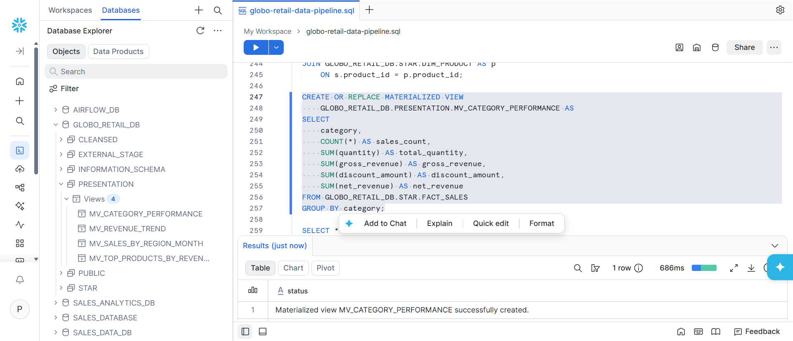 |

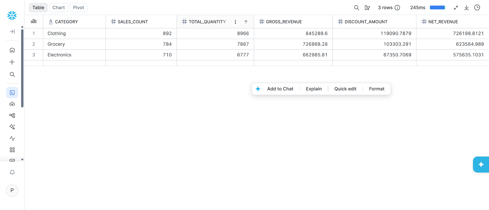

## SQL Structure

The Snowflake implementation is split into ordered scripts:

```text
sql/
├── 01_snowflake_setup.sql
├── 02_loading_cleansed_data_from_s3.sql
├── 03_building_star_schema.sql
└── 04_creating_analytical_mvs_in_snowflake.sql
```

They configure the database objects, load `CLEANSED.SALES_CLEAN`, build the star schema, and create the analytical materialized views.

## Testing

The project tests Pandera schemas, transformation logic, S3 loaders, and Airflow tasks. Warehouse checks compare cleansed and fact-table row counts, look for duplicate identifiers and missing dimension keys, and compare revenue totals.

Run tests and validate DAG parsing from the Astro environment:

```bash
astro dev pytest
astro dev parse
```

## Project Structure

```text
globo-retail-data-pipeline/
├── dags/                 # Airflow DAGs
├── include/              # ETL, pipelines, validation, configuration, and utilities
├── sql/                  # Snowflake setup and ELT scripts
├── tests/unit/           # Unit tests
├── docs/screenshots/     # Project screenshots used in this README
├── Dockerfile
├── requirements.txt
└── README.md
```

## Running the Project

Prerequisites: Docker, Astronomer Astro CLI, an AWS account and S3 bucket, a Snowflake account, and a configured Airflow AWS connection.

```bash
git clone https://github.com/PlamenPlamenovStanchev/globo-retail-data-pipeline.git
cd globo-retail-data-pipeline
astro dev start
```

Configure the required Airflow connection, place the source datasets in the configured S3 raw zone, and trigger the DAG. Execute the Snowflake scripts in numerical order after the ETL output is available.

## Configuration and Security

Runtime configuration is kept separate from credentials and includes S3 zones, Airflow connection IDs, and Snowflake object names. Do not commit authentication values; use placeholders or secret-management facilities instead.

## Key Design Decisions

- **Hybrid ETL + ELT:** Python handles source processing; Snowflake handles warehouse transformations.
- **No DataFrames in XCom:** tasks exchange lightweight metadata and S3 object references.
- **Explicit quality layers:** input validation is observational; output validation blocks invalid analytical data.
- **Preserved rejected data:** unsafe source values remain available for investigation.
- **Parquet interchange:** typed, efficient storage connects ETL with Snowflake.

## Future Improvements

- Add automated data-quality alerts and observability metrics for pipeline failures and rejected-record volumes.
- Introduce incremental Snowflake loads to reduce processing time as source volumes grow.

## Author

Plamen Stanchev

Data Engineering course project demonstrating a hybrid ETL and ELT retail analytics pipeline using Apache Airflow, Amazon S3, Pandera, Parquet, and Snowflake.
